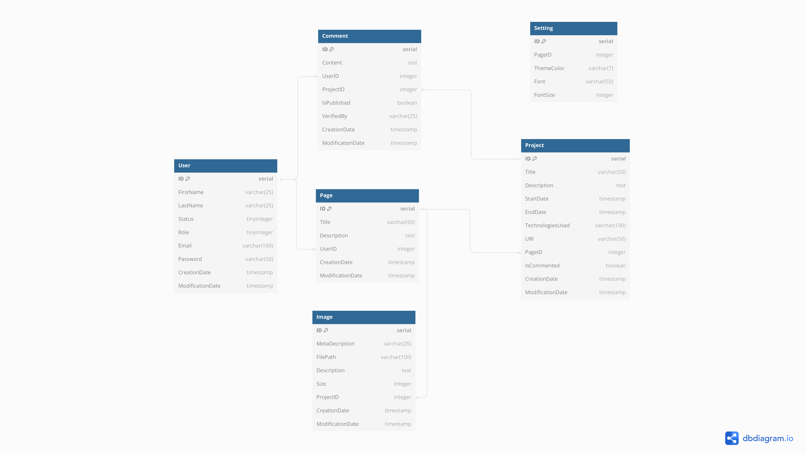

# 📓 Projet Semestriel 3A S1 : Framework PHP

# 📚 Sommaire

- [📝 Contexte](#-contexte)
- [📑 Description Fonctionnelle](#-description-fonctionnelle)
- [📕 Maquette](#-maquette)
- [💻 Outils Utilisés](#-outils-utilisés)
- [💾 Installation](#-installation)
- [📃 Modèle Conceptuel de Données](#-modèle-conceptuel-de-données)
- [📌 Liens Utiles](#-liens-utiles)
- [📋 Fonctionnalités Principales](#-fonctionnalités-principales)
- [🍀 Fonctionnalités Bonus](#-fonctionnalités-bonus)
- [👤 Équipe](#-équipe)

# 📑 Description du Projet

## 📝 Contexte

Dans le cadre du semestre 1 de la 3ème année à l'ESGI, ce projet vise à développer un framework PHP from scratch. Il se concentre sur la création d'un outil robuste et flexible pour la gestion de sites vitrines, en utilisant le modèle MVC (Modèle-Vue-Contrôleur) pour une structure claire et efficace.

## Description Fonctionnelle

Ce framework offre une architecture MVC personnalisée avec un moteur de templating avancé et une intégration SASS pour des interfaces réactives. Utilisant ViteJS pour un développement rapide, il permet une grande personnalisation et contrôle, idéal pour les sites vitrines exigeants.

# 📕 Maquette

[Inclure le lien vers la maquette de votre projet, si disponible]

## 💻 Outils Utilisés

- PHP 8
- Docker
- SASS
- ViteJS
- [Autres outils et technologies pertinents]

## 💾 Installation

Instructions d'installation via Docker pour un déploiement rapide et facile.

````bash
docker-compose up -d
docker-compose exec php yarn install
docker-compose exec php yarn build
docker-compose exec php composer install
````

## 📃 Modèle conceptuel de données



## 📌 Lien utiles

- Github: https://github.com/Abane-S/Projet_semestre_1_esgi
- Email - serveur smtp: https://mail.theomeunier.fr
- Notion: https://www.notion.so/Projet-Challenge-Semestriel-SM1-3IW1-e1c9b30b217a4c03baefb8970b26e6e8?pvs=4
- MCD: https://excalidraw.com/#json=FXlmxoF_6CspwXzozmYbO,KoXlJp6CelQQGFRPxBftuw

## 📋 Fonctionnalités principales

- installation de l'environnement via une interface WEB
- Authentification
    - Register
    - Login
    - Logout
    - Reset password
- Gestion du compte utilisateur (update / suppression (hard et soft delete))
- Gestion de menu dynamique
- Système de routing via fichier YAML
- Gestion des commentaires (gestion de modération)
- Panel d'administration
    - Dashboard avec de la datavisualisation
    - Configuration du templating
    - CRUD des commentaires
    - CRUD utilisation et gestion des rôles (3)
    - Optimisation SEO (Bonne pratiques)
    - CRUD des pages
- SiteMap XML
- ORM Lite

## 🍀 Fonctionnalités bonus:

- Routing par annotation
- Multi-templating
- Design pattern Menento
- Intégration d'un CLI

## 👤 Groupe number two

- Abane SEBIANE - [Github](https://github.com/Abane-S)
- Botan YILMAZ - [Github](https://github.com/TheoPARISOT)
- PARISOT Théo - [Github](https://github.com/BotanESGI)